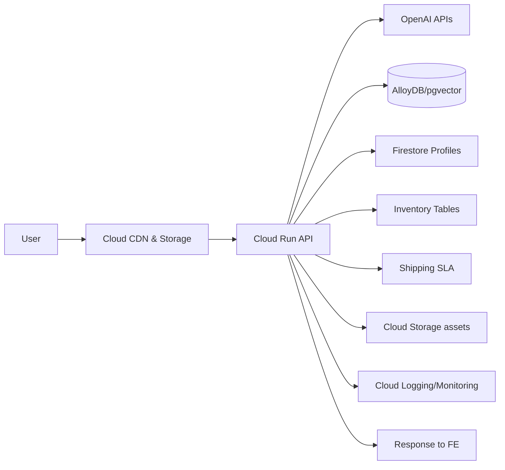
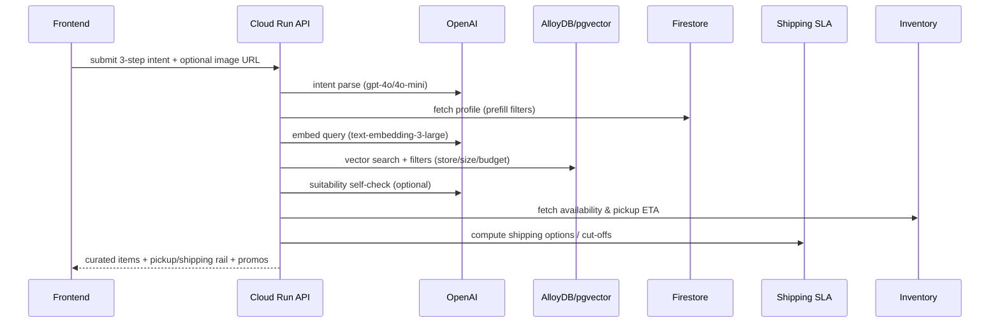
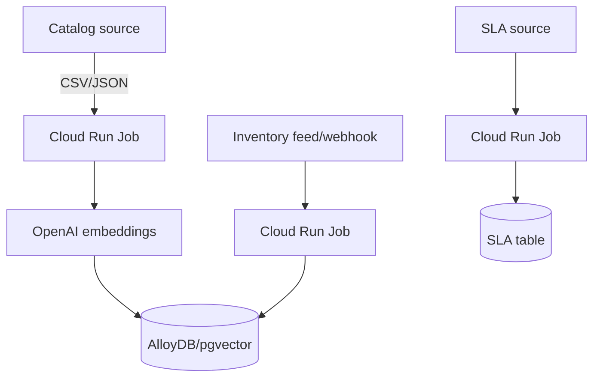

# Architecture: RetailNext Calm Outfit Concierge (GCP-native)

## 1. High-level Stack
- **Frontend**: Static web (HTML/CSS/JS) hosted on Cloud Storage + Cloud CDN; optional Cloud Armor for WAF.
- **API / Orchestration**: Python (FastAPI) on Cloud Run (container), autoscaled; Cloud Run Jobs for batch/ETL.
- **AI**: OpenAI APIs (`gpt-4o`, `gpt-4o-mini`, `text-embedding-3-large`, `omni-moderation-latest`) over outbound HTTPS; Vertex AI not used here except optional Matching Engine alternative.
- **Data**:
  - Product & inventory cache: **AlloyDB for PostgreSQL with vector extension** (or Postgres on Cloud SQL + pgvector) for RAG store and relational joins.
  - Profiles + lightweight session state: **Firestore (Native mode)**.
  - Assets & uploads (images): **Cloud Storage** with signed URLs.
  - Shipping SLA tables / static refs: **Cloud Storage** (CSV/JSON) or **Cloud SQL** reference tables.
- **Messaging/Sync**: **Pub/Sub** for inventory updates; **Cloud Scheduler** + **Cloud Run Job** for periodic ETL.
- **Auth/Secrets**: **Secret Manager** for OpenAI API key and external credentials.
- **Networking**: **VPC** + **Serverless VPC Access** + **Cloud NAT** for egress; Cloud Armor as needed.
- **Observability**: **Cloud Logging**, **Cloud Monitoring**, **Error Reporting**, **Cloud Trace**.
- **CI/CD**: **Cloud Build** -> **Artifact Registry** -> **Cloud Run deploy**.

## 2. Component Responsibilities
- **Web app** (Cloud Storage + CDN): delivers the 3-step intake UI, results view, profile chip/drawer; calls backend JSON APIs.
- **API (Cloud Run)**:
  - Intake & intent parsing: call OpenAI `gpt-4o` / `gpt-4o-mini` for structured intent JSON.
  - Retrieval: query AlloyDB/pgvector for semantic + filter search (availability, store, size, budget, vibe).
  - Guardrails: run moderation and suitability checks via OpenAI moderation + `gpt-4o` self-check.
  - Fulfillment: compute pickup ETA (inventory + store hours) and shipping options (SLA tables); enforce cut-offs/timezones.
  - Profile service: read/write Firestore; apply pre-filters and overrides.
  - “Find similar”: image or text -> vision prompt -> embeddings -> vector search.
- **Batch/ETL (Cloud Run Jobs)**:
  - Catalog ingest -> embeddings -> vector upsert into AlloyDB/pgvector.
  - Inventory sync from source system -> relational tables + availability cache.
  - Shipping SLA refresh (if external).

## 3. Data Model (summary)
- **AlloyDB / pgvector**
  - `products(id, title, description, category, price, currency, attributes JSONB, image_url, updated_at, embedding VECTOR)`
  - `inventory(store_id, product_id, size, qty, updated_at, availability_confidence)`
  - `shipping_sla(region, method, cutoff_time, eta_hours, carrier)`
- **Firestore (profiles)**
  - `profiles/{userId}`: sizes per category, fit, budget band, preferred stores/cities, favorite colors, shipping preference, promo sensitivity, updated_at.
  - `sessions/{sessionId}` (optional): last intent, overrides, anon profile (for guests).

## 4. Flows (Mermaid)

### 4.1 User Flow

### 4.2 Request Sequence (simplified)

### 4.3 Batch Ingest

## 5. Tech Choices & Rationale (GCP-native)
- **Cloud Run**: fully managed, scales to zero, simple HTTPS, good for Python/async + outbound OpenAI calls.
- **AlloyDB/pgvector**: managed Postgres with strong performance and native vector search; keeps product + inventory + embeddings together.
- **Firestore**: low-latency profile and session storage; simple quota and pricing.
- **Cloud Storage + CDN**: cheap, fast static hosting; signed URLs for uploads.
- **Pub/Sub + Scheduler + Run Jobs**: decoupled ingest and periodic sync without servers.
- **Secret Manager**: isolates OpenAI keys and external creds; rotate via IAM.
- **Cloud Armor**: optional WAF/rate limits for public endpoints.
- **Cloud Monitoring/Logging/Error Reporting**: unified SLO tracking and alerting.

## 6. CI/CD
- Source: GitHub (current repo).
- Build: Cloud Build using Dockerfile; store images in Artifact Registry.
- Deploy: Cloud Build trigger on main; roll out to Cloud Run (dev/stage/prod).
- Config: use env vars + Secret Manager; separate projects per env (recommended).

## 7. Security & Compliance
- Least-privilege IAM per service account (API, jobs, CI).
- VPC + Serverless VPC Access + Cloud NAT for controlled egress.
- HTTPS everywhere; HSTS on CDN; signed URLs for uploads.
- No raw image retention; transient processing; redact PII in logs.
- Consent/opt-out for profile persistence (cookies/local storage); regional data residency if required.

## 8. Performance Targets
- API p95 (text flow): ≤ 3.5s end-to-end including profile fetch and retrieval.
- API p95 (image flow): ≤ 5s with vision parsing.
- Ingest SLA: catalog < 15m from arrival; inventory deltas near-real-time via Pub/Sub/webhooks.

## 9. Cost Guardrails
- Use `gpt-4o-mini` for rewrites/classification where possible.
- Batch embeddings; cache frequent intents/results.
- Scale-to-zero defaults on Cloud Run; autoscaling caps per env.

## 10. Open Questions
- Do we require PCI scope for checkout handoff (if embedded) or just deep link?
- Which inventory source patterns are available: push webhooks vs pull feeds?
- SLA data source for shipping (carrier API vs static tables)?
- Regional data residency constraints (Firestore/AlloyDB location choices)?
