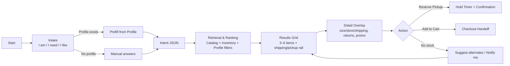
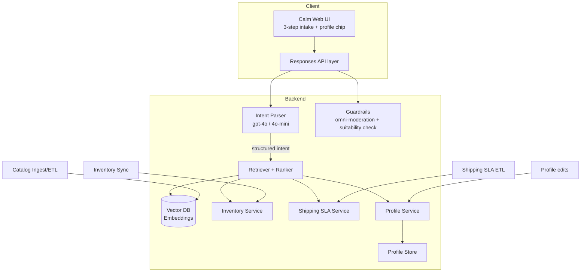
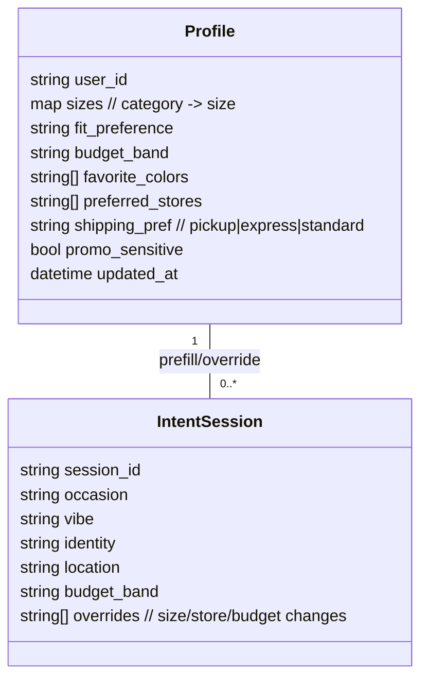

# PRD: RetailNext Calm Outfit Concierge (Country-Agnostic)

## 1. Summary
A minimal, question-led shopping assistant that collects three intent signals (“I am / I need / I like”), then serves in-stock, event-appropriate outfits with pickup and smart shipping options. Powered by GenAI (GPT-4o), embeddings, and inventory-aware retrieval.

## 2. Goals
- Reduce “couldn’t find in store” negative reviews.
- Increase conversion and pickup/express usage for event-driven shopping.
- Improve inventory efficiency via better sell-through of event-tagged items.

## 3. Non-Goals
- Full cart/checkout implementation.
- Payment orchestration.
- Deep personalization beyond stated intent (no long-term profiles in v1).

## 4. Personas
- Fashion-forward professional: time-poor, wants fast pickup/express.
- Event-bound shopper: needs assurance of availability for a date.
- Stylist/associate: uses tool to assist in-store matching quickly.
- Returning customer with profile: expects remembered size, fit, preferred stores, budget band.

## 5. User Stories (v1 scope)
- As a shopper, I answer three quick questions and see 3–6 curated items available near me.
- As a shopper, I can view pickup timing and fastest shipping ETA for each item.
- As a shopper, I can paste a style description or upload an image to “find similar.”
- As an associate, I can filter by store and size to hand a customer ready options.
- As a returning shopper, I want my size, fit, preferred store, and budget remembered so results are pre-filtered.
- As a shopper, I can update or override my profile inline without leaving the flow.

## 6. Functional Requirements
- Three-step intake: identity, occasion, style vibe (free text + suggestions).
- Optional input: style text or image; parse attributes to enrich intent.
- Catalog retrieval: RAG over product + inventory with availability filters.
- Ranking: occasion + vibe relevance, availability confidence, pickup/ETA priority.
- Smart shipping rail: show pickup, same-day courier (if supported), express, standard with cut-off times.
- Contextual merchandising: after answers, inject 1–2 intent-matched promos or “new this week” tags (progressive disclosure, no landing-page banners).
- Limited hero slots: allow up to two curated tiles in the results rail for brand storytelling without clutter.
- Guardrails: validate suitability to occasion and basic safety using GPT-4o + moderation.
- Observability: log queries, selections, and latency (PII-minimal).
- Profile as first-class object:
  - Fields: preferred sizes (per category), fit preference (regular/slim/relaxed), budget band, favorite colors, preferred stores/cities, shipping preference (pickup/express), promo sensitivity flag.
  - Behavior: pre-fill intake answers; auto-filter results by size/store; persist updates per session (cookie/local) and per account when signed in.
  - Overrides: user can switch size/store/budget inline; changes can be saved back to profile on confirm.
  - Eligibility: profile-driven promo eligibility and free-shipping thresholds surfaced when relevant.
- Checkout handoff: deep-link to cart/checkout in host commerce flow with selected item/size/store; support “reserve for pickup” if available.
- Inventory holds: optional reservation window (e.g., 30–60 minutes) for pickup; show hold timer and release behavior.
- Price/promo clarity: display price with tax/fees context; show applied promo/eligibility; ensure ETA respects cut-offs/timezones.
- Returns visibility: flag return/exchange eligibility (final sale/altered) inline.
- Substitutions: when size/color unavailable, suggest nearest alternatives or “notify me.”
- Localization hooks: currency/units/language ready (even if v1 single market).
- Accessibility: target WCAG 2.1 AA for focus order, labels, and chip controls.
- Edge states: empty results, degraded inventory/ETA services, timeouts with graceful fallback messaging.
- Admin levers: toggle promos/hero tiles by segment without code deploys.

## 7. UX Requirements
- Calm, minimal UI; three-step flow then results grid.
- Progressive disclosure: promos and new-arrival signals appear only after intent capture.
- Surface earliest fulfillment (pickup or shipping) above the fold with ETA and cut-off clocks.
- Limit visible recommendations to 3–6 items; allow “see more.”
- Subtle freshness cues: “Arrived this week” or “New drop” tags instead of hero banners.
- Accessible: keyboard focus, aria labels on inputs/buttons.
- Mobile-first responsive layout.
- Profile affordances: small, non-intrusive profile chip showing size/store/budget; tap to edit inline drawer. Default to local/session storage if not signed in; respect privacy.
- Edge-state UX: clear messaging and recovery for empty results, service outages (inventory/ETA), and timeouts; always show a viable next action (broaden filters, pickup-first, notify-me).
- Checkout/hold UX: if “reserve for pickup” is supported, show hold timer and release state.

## 8. Screen Flow (v1)
1) Intake: three calm questions (“I am / I need / I like”) with optional text/image input.  
   - If profile exists, pre-fill answers and show a profile chip with a quick-edit drawer.  
2) Results: 3–6 curated items, pickup ETA and shipping rail, limited hero tiles, contextual promo chip (optional), applied filters from profile (size/store/budget) with inline overrides.  
   - Empty/degraded state handling (inventory/ETA errors) with recovery actions.  
3) Detail overlay (lightweight): size availability, pickup location, fastest shipping option; CTA to reserve or continue in primary commerce flow; option to “save to profile” updated size/store prefs; show returns eligibility and price/promo clarity.  
4) Profile drawer (global): edit size/fit, budget band, preferred stores, shipping preference, promo sensitivity; save and apply immediately.  
5) Checkout/reserve handoff: deep link with selected attributes; optional hold timer display if reservation is used.

## 9. Data & Integrations
- Inputs: catalog (titles, descriptions, images), inventory by store, shipping SLA tables, store geos.
- Metadata: occasion tags, seasonality, dress code, fabric/comfort, size range, availability confidence.
- Integrations: inventory service, shipping rate/ETA service, geolocation (city/lat-lon) if allowed.

## 10. AI/LLM Requirements
- Models: `gpt-4o` for vision+reasoning; `gpt-4o-mini` for lightweight tasks; `text-embedding-3-large` for retrieval; `omni-moderation-latest` for safety.
- Prompts: structured JSON outputs for intent parsing and match validation; self-check for outfit suitability.
- Latency target: <= 2.5s p95 for intent parse + retrieval + response (excluding image upload time).
- Cost guardrails: use mini model for rewrites/classification; batch embeddings offline.
- Performance SLO with profile: profile fetch/update keeps end-to-end p95 <= 3.5s (text flow).

## 11. Performance & Reliability
- Results response p95 <= 3.5s end-to-end (text flow); <= 5s with image.
- Graceful degradation: if shipping ETA fails, still show pickup; if inventory stale, show “check in store.”
- Caching: short-lived cache for popular intents and static assets.

## 12. Security & Privacy
- Avoid storing raw images long-term; transient processing only.
- PII minimization: city-level location; no exact addresses in v1.
- Follow platform moderation for user input and generated text.
- Image privacy: transient handling; no raw image logging; redact PII from prompts/logs.
- Consent: if cookies/local storage used for profile, follow applicable consent requirements; allow opt-out/reset.

## 13. Success Metrics
- Reduction in “not found”/availability-related negative reviews.
- Conversion lift vs control for event-driven sessions.
- Pickup/express attach rate on recommended items.
- Retrieval quality (human-rated relevance) >= 4/5 for top 3 items.
- A/B uplift for intent-led minimal flow vs promo-heavy control (by segment).
- Profile impact: uplift in conversion and time-to-first-pick for returning users with profile vs without; opt-in rate to profile edits.
- Reservation effectiveness: completion rate for reserved pickups; drop-off during hold window.
- Checkout handoff success: click-through and completion rate from deep link.
- Edge-state recovery: % of empty/degraded sessions that continue to an action (broaden, notify, pickup).

## 14. Risks & Mitigations
- Stale inventory → frequent inventory sync; display confidence and last-updated time.
- Model hallucination → structured prompts + guardrail validation step.
- Latency from image analysis → optional image path; compress images; use mini model for pre-filtering.
- Shipping ETA variability → show cut-off clocks and ranges; fall back to pickup-first messaging.
- Minimal UI suppresses promo-seekers → segment-based experiences; contextual offers post-intent; run A/B by traffic source.
- Checkout/hold ambiguity → explicit timers and confirmation for reservations; clear handoff state.
- Localization gaps → define fallback locale and formatting; test currency/units early.

## 15. Open Questions
- Which regions/stores participate in same-day courier? SLA data source? 
- Do we support size reservations or only visibility? 
- Do we need multi-language microcopy in v1?

## 16. Milestones (suggested)
- Week 1: Data ingestion + embeddings + simple retrieval API.
- Week 2: Three-step UI wired to API; pickup/shipping rail stubbed.
- Week 3: Guardrail validation + shipping ETA integration; polish UI.
- Week 4: Pilot with 1–2 regions/stores; collect feedback and tune ranking.

## 17. Diagrams

**17.1 User & Screen Flow**

**17.2 System Architecture (High Level)**

**17.3 Profile Data Model (Simplified)**

